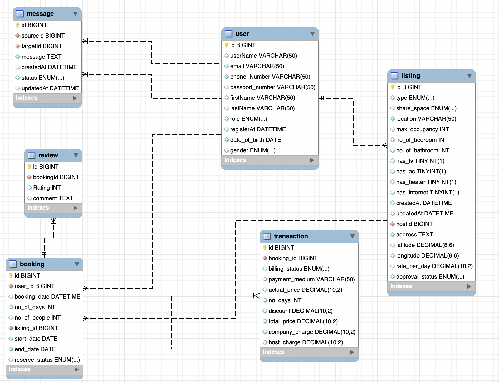

# miniGroup5MDD
<h1>
 THIS resp is created and used for study only in the university class only </p:w></h1>

## TO USE
> run the `allrunner_almost_done.sql` file in Mysql
> then you good to go try to run the basic sql command `basicqry.sql` 

## DIAGRAM

