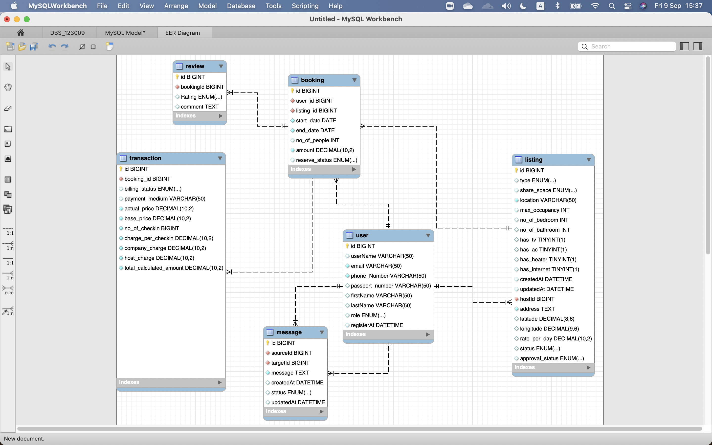

# miniGroup5MDD
<h1>
 THIS resp is created and used for study only in the university class only </p:w></h1>

## TO USE
> run the `allrunner.sql` file in Mysql
> then you good to go try to run the basic sql command `basicqry.sql` 

### Or run with new version -> transaction playground
> run `allrunner_with_feature.sql` instead
> this file have blank transaction loaded. If any can pull the value from another column, please add them.

## DIAGRAM

